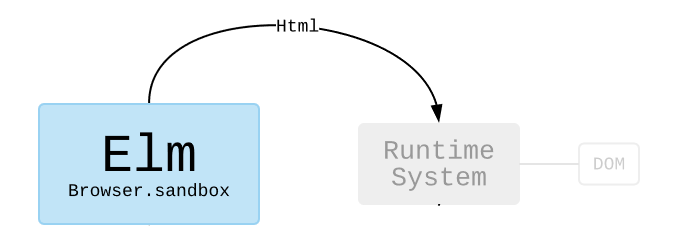

# Default Webapp (Elm & ZEIT Now edition)
My default (opinionated/favourite) setup for web application development&mdash;a [single-page application (SPA)][spa] with client-side rendering, to be more precise.
(I guess that statement (the opinionated/favourite part) will remain true one year after the date of the last commit, at least...)

This is first and foremost a personal write-up.
Yet, it will (maybe) end up like a "web project starter", a well-documented starting-point for a project, like a boilerplate&mdash;or just a basic tutorial.
I will take a somewhat "naive approach" when growing this codebase&mdash;arguing for and introducing features and tooling on the way as we go along, commit by commit, statement by statement&mdash;**stay tuned!**

A live version is hosted on [ZEIT Now][now], as [defaultwebapp.now.sh](https://defaultwebapp.now.sh).

...

This repository/project is sort of an update of my previous ["default webapp"][default-webapp-heroku] project, developed in 2014-2015.
(It is a kind of personal [code kata][kata].)
The most important change is that the "embedded" Node.js-based server API is gone.
I will try to use services maintained and hosted elsewhere only.
Many of the components from the client-side project are now replaced by other preferred components&mdash;e.g. like JavaScript/[React][react]/[Redux][redux] being replaced by [Elm][elm], [Grunt][grunt] being replaced by [webpack][webpack], [Heroku][heroku] being replaced by [ZEIT][zeit]'s [Now][now].
Also, some components are kept the same, like [Sass][sass], and probably the look & feel. (I am not a UX guy.)


* * *


OK, the very first thing to do, is getting our new webapp online;
Deploying the most basic version imaginable of our webapp to our hosting service of choice.

## Prerequisites
_To be very basic and specific_, the only prerequisites are:
- Some knowledge of English ;-)
- A computer, a steady supply of electric power, and network connectivity ;-)
- An email account and an email client&mdash;signed in

Then:
1. Install [Node.js][node] (The package manager tool, _npm_, is included).

   While at it&mdash;update npm (which release cycle is more frequent than Node.js'):
   ```bash
   npm install npm@latest --global
   ```

1. **Name your project/webapp**&mdash;first and foremost you need an official (natural language) name.
Then create:
   - a source-code-friendly name variant with no whitespace characters
   - a URL-friendly name variant with no whitespace characters, and lowercase characters only (hyphens allowed)
1. Using the new name, **create a project folder**&mdash;and at that location, open your command-line interface (CLI) of choice.

### ZEIT Now: Deployment to staging
Deploy/Publish your webapp using [ZEIT Now][now].
Let's get our first version online in an instance:
```bash
now
```
That fails&mdash;unknown command&mdash;install the ZEIT Now client:
```bash
npm install now@latest --global
```
Try again:
```bash
now
```
That fails&mdash;nothing to deploy&mdash;add a file to deploy (e.g. in a Windows Command Prompt):
```bash
TYPE NUL > index.txt
```
Try again:
```bash
now
```
If you don't have an account yet;
_Type in your email address_&mdash;_go to your email client_&mdash;_verify your email address_.
You now have a ZEIT Now account - also, you are now signed in.

Try again:
```
now
```
Give the deployment confirmation a '`y`' - and that's it!
**Your webapp is online** - the very, very first version of it that is...

Paste the given URL into a browser tab and have a look.
The deployed webapp is not particularly interesting&mdash;it is completely empty.
Ok, let us create our very first version with some actual content (again e.g. in a Windows Command Prompt):
```bash
ECHO Default Webapp - ZEIT Now edition (v0.1.1) > index.txt
```
Deploy (again):
```
now
```

Do notice that a certificate for the site is generated on-the-fly&mdash;thanks to [letsencrypt.org](https://letsencrypt.org)).
(This enables [HTTPS][https] which facilitates encryption of data sent over the wire, and server-side authentication.)

### ZEIT Now: Deployment to production
ZEIT Now auto-generates a URL for the commissioned resource.
It is to be regarded as a staging area for your deployment.
_To fully put the webapp into production, then "alias" the staged area to your preferred URL_, like this:
```bash
now alias ${project folder name}-${auto-generated staging-id}.now.sh ${my-webapp-id}
```
E.g.:
```bash
now alias default-webapp-elm-now-olkrehlqms.now.sh defaultwebapp
```
### ZEIT Now: More convenient deployment to production
Creating all those staging-to-production aliasing commands can be cumbersome.
ZEIT Now has a configuration file&mdash;`now.json`&mdash;that helps out with that.
`now.json` has a property `alias` which will be assigned to the latest deployment when running `now alias` (with no arguments).
So, e.g., for automating deployment to my default webapp `defaultwebapp`:
```bash
ECHO {"alias":"defaultwebapp"} > now.json
```
Update "content":
```bash
ECHO Default Webapp - ZEIT Now edition (v0.1.2) > index.txt
```
Now, to deploy to staging, _and_ at the same time, create a production alias of the deployment, just:
```bash
now --public & now alias
```
Check the easy-to-remember URL, <https://defaultwebapp.now.sh> in all browsers available.


* * *


## Changelog
Growing the capabilities of this project setup, and the webapp itself&mdash;Commit by commit.

### v0.1: Establish project and deploy to ZEIT Now
The v0.1.x commits are:

#### v0.1.0: Empty static single resource [ [commit](https://github.com/eirikt/default-webapp-elm-now/commit/56863c2f0285c45f903f5028db06b076c0bbe298) | [deployment](https://file-pmqnhwkidm.now.sh) ]
(See above.)

#### v0.1.1: Static single plain text resource [ [commit](https://github.com/eirikt/default-webapp-elm-now/commit/1cedc30a49a1738c6f5f64938537b6cdc3757de6) | [deployment](https://file-iomajqiucy.now.sh) ]
(See above.)

#### v0.1.2: Single static web resource [ [commit](https://github.com/eirikt/default-webapp-elm-now/commit/62c30d234434e46637d7db8cc074de6602ee2d09) | [deployment](https://file-xkfehobloq.now.sh) ]
`text/plain` content type replaced by [`text/html`][html] content type&mdash;giving us quite a bit more possibilities.

#### v0.1.3: Text formatting [ [commit](https://github.com/eirikt/default-webapp-elm-now/commit/9eb77c484ea273caeec36a3c187bb824f28762bc) | [deployment](https://file-eswpsfmlgn.now.sh) ]
Very basic [HTML][html] tags added.
(HTML tutorials and  [WYSIWYG][wysiwyg] editor helpers are all over the web.)

#### v0.1.4: Convenient deployment to production [ [commit](https://github.com/eirikt/default-webapp-elm-now/commit/3d6cdd9c4944878ea9ce5e2c6ed36e79ffea95f4) ]
(See above.)

### v0.2: Project layout & Building with npm and webpack
The v0.2.x commits are:

#### v0.2.0: Project layout  [ [commit](https://github.com/eirikt/default-webapp-elm-now/commit/03ca6f91da131e70cdffaa3632a22a3e8ed754c4) | [deployment](https://build-epqechqdql.now.sh) ]
This commit includes:
- A designated source folder, `src`, should include most source files.
Left out in the project root are documentation, license, and project-wide configurations.
Also, the `index.html` file got some more [CSS][css] styling.

- A designated build folder, `build`, brings the need of a `.gitignore` file, ignoring that folder from version control.
Also, it mandates a change in the ZEIT Now configuration file `now.json`&mdash;where the deployment prefix (`name`) goes from default (project folder name) to `"name":"build"`. Read about the `now.json` configuration file [here][now-json].

- The only "build" step so far is just to copy the `src/index.html` file to the `build` folder&mdash;_manually for now_. (We definitely have to do something about that.)

#### v0.2.1: npm [ [commit](https://github.com/eirikt/default-webapp-elm-now/commit/39b770bd209c35f7504461d61c155ab448c4727b) ]
[_npm_][npm] originally was the "Node.js Package Manager", but is now become the de-facto tool for all web and JavaScript-based projects.
All project meta-information and package/component dependencies goes in its `package.json` project configuration file.

We start with a default `package.json`, which we will extend in the following commits.

...

An alternative to npm is [yarn][yarn].
Yarn and npm has, at the moment, quite similar functionality&mdash;so being the "original" and bundled with Node.js, npm is the more idiomatic choice.

#### v0.2.2: License [ [commit](https://github.com/eirikt/default-webapp-elm-now/commit/a4b903be553be8549453ae82170ac0cf9165d0be) ]
Add a license file reflecting what is stated in `package.json`.
GitHub [recommends](https://help.github.com/articles/licensing-a-repository) putting a license file at the root of the source repositories, so let us go with that.

#### v0.2.3: webpack [ [commit](https://github.com/eirikt/default-webapp-elm-now/commit/5e02ffa656099dfe0599ad56061d880a343d406f) | [deployment](https://build-jzwvseuphj.now.sh) ]
[Webpack][webpack] is a powerful web application builder.
It builds a dependency graph which maps every module your project needs and generates one or more bundles. It has [four central concepts][webpack-concepts]:
1. _Entry_&mdash;An entry point indicates which module webpack should use to begin building out its internal dependency graph.
webpack will figure out which other modules and libraries that entry point depends on (directly and indirectly).

   Default is `./src/index.js`

1. _Output_&mdash;The output property tells webpack where to emit the bundles it creates and how to name these files.

   Default is `./dist/main.js`

1. _Loaders_&mdash;Out of the box, webpack only understands JavaScript files.
Loaders allow webpack to process other types of files and convert them into valid modules that can be consumed by your application and added to the dependency graph.

   Loaders have two properties in your webpack configuration:
   - `test`, a [regular expression][regex] identifying which file(s) that are to be transformed
   - `use` indicates which loader should be used to do the transforming of the files identified by the `test` entries

1. _Plugins_&mdash;While loaders are used to transform certain types of "resource modules", plugins can be leveraged to perform a wider range of tasks like bundle optimization, asset management and injection of environment variables.

...

Alternatives to webpack are [Grunt][grunt], [Gulp][gulp], and [Parcel][parcel].
I must admit I am not a huge webpack fan&mdash;I find the API semantics a bit confusing and overly complicated.
Anyway, webpack is clearly the idiomatic build tool choice these days.

###### Our first config
As our first _entry_, we direct webpack to... our only source file:
```javascript
entry: path.join(__dirname, 'src/index.html'),
```

As our first _output_, we direct webpack to our build folder:
```javascript
output: {
    path: path.join(__dirname, 'build'),
    filename: 'index.js',
}
```

In this first `webpack.config.js` we are using webpack for what it is not intended for&mdash;simple file copying.
That is why we are using a _plugin_, `ignore-emit-webpack-plugin`, to simply ignore and suppress the emitting of the webpack bundle `ìndex.js`, and just using the _loader_ `file-loader` to copy the `index.html` to our `build` folder.

We will be using webpack more idiomatically in the subsequent commits.

###### As a build script
Add our first npm script/task/command in `package.json`:
```json
"scripts": {
    "build": "webpack"
},
```

Install and add webpack as a development dependency in `project.json`:
```bash
npm install webpack --save-dev
npm install webpack-cli --save-dev

npm install file-loader --save-dev
npm install ignore-emit-webpack-plugin --save-dev
```
And run our scripted new task:
```bash
npm run build
```
#### v0.2.4: Semantic project tasks [ [commit](https://github.com/eirikt/default-webapp-elm-now/commit/93a7c1bb1b81b2b3ffb05a9c529d1c91678bdd0f) | [deployment](https://build-vwmktnocgx.now.sh) ]
In our `package.json`, (simple) scripts for project tasks/phases are added&mdash;chronologically:
1. _setup_
1. _clean_
1. _build_
1. _deploy to staging_
1. _deploy to production_

At all times we can list all npm scripts/tasks/commands with:
```bash
npm run
```
So from now on we can, e.g. deploy (from scratch) to staging with a single command:
```bash
npm run deploy
```
### v0.3: Using Elm
[Elm][elm] is a statically typed, pure functional programming language.
By that, it brings (by default, out-of-the-box) good stuff like:
- [Immutability](https://en.wikipedia.org/wiki/Immutable_object)&mdash;shared mutable state is just a nightmare in computer applications

- [Sum types](https://en.wikipedia.org/wiki/Tagged_union)&mdash;which together with the enforced static type checking eliminates [null references](https://en.wikipedia.org/wiki/Null_pointer)

- Partial function application&mdash;which enables [currying](https://en.wikipedia.org/wiki/Currying), which facilitates creating highly reusable "configurable" functions

Elm [transpiles](https://en.wikipedia.org/wiki/Source-to-source_compiler) to ECMAScript 5. Hence, without any further transpiling, leaves Internet Explorer 8 and all those even more ancient browsers behind.

[Install](https://guide.elm-lang.org/install.html) Elm.

...

The v0.3.x commits are:

#### v0.3.0: Building an Elm-based project with webpack [ [commit](https://github.com/eirikt/default-webapp-elm-now/commit/f612d9278c2cd2af07f5b2ef0db81efe9ac12732) | [deployment](https://build-ysgfanfbnz.now.sh) ]
First we remove the `src/index.html` file.
It is replaced by the [HTML Webpack Plugin][html-webpack-plugin], which is now responsible for producing the `index.html` output file.
In this first version we just let the HTML Webpack Plugin do its default thing:
```javascript
plugins: [
    new HtmlWebpackPlugin()
]
```
The default behaviour is to generate a vanilla `index.html` in which our configured `entry` is loaded as its sole body content.
The `entry` in `webpack.config.js` is changed to:
```javascript
entry: path.join(__dirname, 'src/index.js'),
```
(It is the default `entry` in webpack so we do not actually have to include it in our `webpack.config.js`. Yet we include it for completeness.)

So, we add a `src/index.js` file, in which we do two things:

1. Load all Elm sources, and transpile it to JavaScript, including the Elm runtime:
   ```javascript
   const app = require('./elm/Main.elm');
   ```
   This little statement is JavaScript code that will be executed in the browsers.
   For the small amounts of JavaScript we will use, we will, as a principle, use modern JavaScript.
   Here we are using ECMAScript 2015 features&mdash;which means that Internet Explorer 10 and older browsers at the moment are unsupported in this webapp.
   Support for older browsers can be achieved by an extra transpiling step (which we will introduce in later commits)&mdash;but only add it if the customer explicitly asks for/demands it when you inform them about this choice.

   ###### Elm-based content
   We have to add the requested `src/elm/Main.elm` source file. e.g.:
   ```elm
   import Html
   main = Html.text "Default Webapp - Elm & ZEIT Now edition [v0.3.0]"
   ```
   This is the Elm version of "Hello World", which just emits an escaped text.
   (A core Elm package is imported and used, [elm/html/Html][elm-html-html].)

   ###### Elm-webpack-loader
   To parse and transpile Elm to JavaScript, we need to add a webpack loader, the [Elm loader][elm-webpack-loader] (`elm-webpack-loader`).
   In `webpack.config.js`, add:
   ```javascript
   module: {
       rules: [{
           test: /\.elm$/,
           use: [{
               loader: 'elm-webpack-loader'
           }]
       }]
   }
   ```
   It will transpile the Elm source code to ECMAScript 5 source code using the Elm standard `make` tool (which is included in the standard Elm install).
   Also, the _Elm ECMAScript 5-based runtime_ will be added to the generated code.
   More on the Elm runtime later.

1. Execute this generated JavaScript, and add it to a DOM element we know is present in the generated `index.html`.
   ```javascript
   app.Elm.Main.init({
       node: document.getElementsByTagName('body')[0]
   });
   ```

We are ready for the new build.
What remains is updating our npm dependencies:
```bash
npm uninstall file-loader
npm uninstall ignore-emit-webpack-plugin

npm install elm-webpack-loader --save-dev
npm install html-webpack-plugin --save-dev
```
And then build:
```bash
npm run build
```
...

Finally, update the generated `elm.json` with `src/elm` instead of just `src`, and add the new output folder `elm-stuff` in the `.gitignore` file.

#### v0.3.1: webpack mode [ [commit](https://github.com/eirikt/default-webapp-elm-now/commit/9da7cc3c5eb0139b0599af6e857b2466fded5590) | [deployment](https://build-ndysvvuckb.now.sh) ]
Webpack has two modes, "development" and "production".
By default, "production" is chosen.
In "production" mode webpack does several tasks preparing the build for deployment to a production environment, e.g. minification.
So, while developing, we explicitly choose "development".
Add the mode in `webpack.config.json`:
```javascript
const config = {
    mode: 'development',
    ...
}
```

#### v0.3.2: Using an HTML template [ [commit](https://github.com/eirikt/default-webapp-elm-now/commit/47627c4b9c371923e890611c8a6a3aab0ce6d6cc) | [deployment](https://build-ahhwscxgwo.now.sh) ]
The [HTML Webpack Plugin][html-webpack-plugin] can generate the `index.html` from scratch, as it is doing now.
But also, it can create it based on a _template file_.
That is preferable, as it gives us both more control and convenience.
Add the `template` option in the HTML Webpack Plugin configuration:
```javascript
plugins: [
    new HtmlWebpackPlugin({
        template: path.join(__dirname, 'src/index.template.html')
    })
]
```
We must now provide the `src/index.template.html` file, e.g. a very barebone one:
```html
<div id="elmContainer"/>
```
The `src/index.js` must be updated with
```javascript
app.Elm.Main.init({
    node: document.getElementById('elmContainer')
});
```
The HTML element `elmContainer` will be _replaced_ by the Elm-generated content.

### v0.4: Styling with Sass
Choosing a strategy for styling the webapp is not straightforward any more,
especially when one is not well-wandered in the UX domain.

As we have chosen Elm as our primary tool for creating the webapp, it would be natural to go with Elm's own type-safe, CSS-wrapping, styling alternative&mdash; [elm-css](https://package.elm-lang.org/packages/rtfeldman/elm-css/latest).
That might well be what we end up doing in the end, but I feel that the present solution for styling works well enough.
It is a separate, modular solution for the "look & feel" concern of the webapp.
And when using a CSS extension like [Sass][sass] (or specifically SCSS, "Sassy CSS"), we have a powerful technical foundation to work with.
Sass supports niceties like variables, nesting, inheritance, mixins, and imports.
Also, when adhering to ad-hoc techniques for improving reusability like [BEM][bem]&mdash;Block Element Modifier, and maybe also [SMACSS][smacss]&mdash; we are well-equipped for safe and convenient styling.
(Of course, sticking to Sass will also make it easier to compare this codebase to my previous ["default webapp"][default-webapp-heroku] project.)

...

Alternatives to Sass are standard CSS, and [Less][less] (still, maybe).
Also, encapsulation and scoping of CSS with e.g. [CSS Modules][css-modules] or [CSS Blocks][css-blocks] I have chosen to skip for the moment.
Another alternative is to go with a complete styling framework like [Twitter Bootstrap][twitter-bootstrap] (Elm port [here](https://github.com/aforemny/elm-mdc)) or [Google Material Design][google-material-design] (Elm port [here](http://elm-bootstrap.info)).
Those seem too invasive for this minimalistic and basic setup.

...

The v0.4.x commits are:

#### v0.4.0: Sass with webpack [ [commit](https://github.com/eirikt/default-webapp-elm-now/commit/a870fbf621de8f75e3dc35f562c0518cf8319c85) | [deployment](https://build-pwrjvwrvzv.now.sh) ]
As Sass/CSS is a completely separate (domain-specific) programming language, it must have its own entry in webpack configuration:
```javascript
entry: [
    path.join(__dirname, 'src/index.js'),
    path.join(__dirname, 'src/scss/style.scss')
],
```
...with a loader setup:

```javascript
test: /\.scss$/,
use: [{
    loader: 'style-loader'
}, {
    loader: 'css-loader'
}, {
    loader: 'sass-loader'
}]
```
The [Sass Loader][sass-webpack-loader] turns `style.sass` into plain CSS.
The [CSS Loader][css-webpack-loader] takes the CSS file and returns the CSS with `import`s and `url(...)` resolved via webpack's require functionality.
The [Style Loader][style-webpack-loader] inserts those styles into the HTML page, and by that into the browser's DOM.
(Do notice that webpack loaders are applied from the bottom up.)

For the new `src/scss/style.scss` we are starting with a trivial and silly font declaration just to see that things are working:
```sass
@charset "UTF-8";
body { font-family: Comic Sans MS, cursive, sans-serif; }
```
...

What remains is updating our npm dependencies:
```bash
npm install style-loader --save-dev
npm install css-loader --save-dev
npm install sass-loader --save-dev
npm install node-sass --save-dev
```
And then build:
```bash
npm run build
```

### v0.5: Static code analysis
Before starting on the actual building of the visual parts of the webapp, let us have a look at tooling.

Establishing some, uhm, common "values" for the codebase is helpful.
Manual code reviews are fine and well, but externalizing as much of coding concerns as possible is preferable&mdash;"objective truths" tend not to create grudges in the same way "subjective truths" may.
Automated feedback is also preferable over manual tasks, always.

Elm gives us static code analysis in the form of strict, enforced static type checking and enforcement.
Let us extend the build-time checking with things like:
- Code style
- Coding idioms
- Third-party versions
- Third-party licenses

These are concerns that can be _enforced_, e.g. by tools like [git-hooks-plus](https://www.npmjs.com/package/git-hooks-plus),
or quite easy with the [husky](https://github.com/typicode/husky)/[lint-staged](https://github.com/okonet/lint-staged) combo.
A clear candidate for such enforcement is Elm source code formatting, which has its own established code style rules.
Still, I choose not to include that kind of automation yet, maybe later.

...

Alternatives to the internal tools below are the plethora of external services, e.g. those available as [GitHub Apps](https://github.com/marketplace/).
As none of those supports Elm (for some strange reason), let us use local tools for now.

...

The v0.5.x commits are:

#### v0.5.0: `npm audit`, for known security issues [ [commit](https://github.com/eirikt/default-webapp-elm-now/commit/7c93447c1082a4e12dec6634d9e722f972c6a085) ]
npm now includes a tool for running security audits, `npm audit`.
Let us add it as our `check:1` task.

#### v0.5.1: `npm-check`, for third-party component versions [ [commit](https://github.com/eirikt/default-webapp-elm-now/commit/090dba3c56bdcd579a5049f7b5c764f80a7b26b1) ]
npm also includes a tool for checking versions for third-party dependencies, `npm outdated`.
Yet, the external package [`npm-check`](https://www.npmjs.com/package/npm-check) does a slightly better job of presenting its findings.
(Its 'unused dependency' check does not yet support webpack though, but I am sure [it will soon](https://github.com/dylang/npm-check/issues/304)...)
```bash
npm install npm-check --save-dev
```
Let us add it as our `check:2` task.

#### v0.5.2: `npm update` [ [commit](https://github.com/eirikt/default-webapp-elm-now/commit/3f68c3947575b0d3b44a637ceeff3ae8d482c10a) ]
Based on our newly created task:
```bash
npm run check:2
```
It suggested, at the time of writing, these packages to be upgraded:
```bash
npm update webpack
npm update webpack-cli
npm update node-sass
npm update style-loader
```

#### v0.5.3: `elm-analysis`, for Elm code style and idioms [ [commit](https://github.com/eirikt/default-webapp-elm-now/commit/9c74b615406f472d1c195379beaa2aa2eef065fd) ]
[Elm Analyse][elm-analyse] analyses your Elm code, identifies deficiencies and applies best practices.
```bash
npm install elm-analyse --save-dev
```
Let us add it as our `check:3` task.

**NB!** As of now, Elm Analyse [does not yet support Elm v0.19](https://github.com/stil4m/elm-analyse/issues/176)!
So this task is not applicable until it does.
But also, Elm Analyse has to replace its outdated [open](https://github.com/jjrdn/node-open) dependency, otherwise we sadly have to ditch this excellent tool.

#### v0.5.4: `elm-format`, for Elm code style [ [commit](https://github.com/eirikt/default-webapp-elm-now/commit/db65850d4f9c36ac4807cbb2d2628c61a4734b91) ]
Elm has included and established some modern features, making it stand out amongst programming languages.
One of them is _enforced [semantic versioning][semver]_.
Elm detects all API changes automatically (thanks to its type system), and uses that information to guarantee that every single Elm package follows a semantic versioning scheme.
Another "feature" is _official and well-established code style_.
It is not enforced out-of-the-box, but can be automatically applied by the [elm-format][elm-format] tool.

Add it:
```bash
npm install elm-format --save-dev
```
By the way, there is really no reason not to add it as a global package:
```bash
npm install elm-format --global
```
And create a task in `package.json` that formats all our Elm code:
```javascript
"scripts": {
    ...
    "elm:format": "elm-format src/elm/ --yes",
    ...
},
```

#### v0.5.5: `sass-lint`, for Sass code style and idioms [ [commit](https://github.com/eirikt/default-webapp-elm-now/commit/096ad5ce10d9ef936a4f04c1ae9e257ac1851d66) ]
The other main programming languages involved in our little project is Sass.
Sass has [linters](https://en.wikipedia.org/wiki/Lint_(software)) too, e.g. [Sass Lint][sass-lint]:
```bash
npm install sass-lint --save-dev
```
Sass Lint can be configured from a `.sass-lint.yml` or `.sasslintrc` file in your project.
We will not do that yet&mdash;rather we will just follow the [default configuration](https://github.com/sasstools/sass-lint/blob/master/lib/config/sass-lint.yml).

#### v0.5.6: EditorConfig, for common IDE behaviour [ [commit](https://github.com/eirikt/default-webapp-elm-now/commit/bc8d70d1772dc84aee815250b4de7f4782ca29ae) ]
A nice, beloved text editor (or even a full-blown, hopefully not bloated, integrated development environment (IDE)) is an integral part of a software developer's life.
Even we are somewhat restricting individual preferences in this setup, the IDE should be free of choice.
For "organizational scaling" concerns, we are creating a common ground for IDEs with [EditorConfig](https://editorconfig.org), IDE-agnostic editor configurations.
That consolidates e.g. issues like _[whitespace](https://en.wikipedia.org/wiki/Whitespace_character) handling_&mdash;important for avoiding unnecessary version differences.

So, the text editors/IDEs used by project developers should support EditorConfig internally or via a plugin.
The list of text editors/IDEs having support for EditorConfig is to be found [here](https://editorconfig.org/#download).
I use [Atom][atom] with the [EditorConfig plugin](https://github.com/sindresorhus/atom-editorconfig) installed.

### v0.6: Live reloading & Hot reloading
Before (finally) starting on the actual building of the visual parts, let us set up a smooth development environment where the goal is fast and frequent micro-iterations, making short feedback loops possible.
The principle of short feedback loops when developing are discussed e.g. in Brett Victor's excellent [talk](https://vimeo.com/36579366), in which he talks about the necessity of having an immediate connection with what you create.

...

The v0.6.x commits are:

#### v0.6.0: Developing with _live reloading_ [ [commit](https://github.com/eirikt/default-webapp-elm-now/commit/e41d1b22a9ba6d70cd9d4dab5c204282002811f2) ]
"Live reloading" means that the entire webapp is reloaded for every change we do in our codebase.
It is like automatic pushing of `F5`.

This is easily implemented by using webpack's [DevServer](https://github.com/webpack/webpack-dev-server).

Add it as a script/task/command in `package.json`:
```javascript
"scripts": {
    ...
    "dev": "webpack-dev-server",
    ...
},
```
Install it:
```bash
npm install webpack-dev-server --save-dev
```
...and run it:
```bash
npm run dev
```
Now, go to <http://localhost:8080>.
Check if live reloading works&mdash;all files in `src` folder should be monitored for changes.

#### v0.6.1: Even better, developing with _hot reloading_ [ [commit](https://github.com/eirikt/default-webapp-elm-now/commit/d15f7c8878781b99128b3d4ec0fc5f6abc98b231) ]
"Hot reloading" means that just the DOM elements that have altered content are being updated (by directly manipulating the DOM).
That leads to a more "smooth" developer experience than "live reloading" provides.
Also, this is how the actual user experience will be, because this is accomplished by the one-directional data flow which Elm utilizes.

This is easily implemented by using [elm-hot-webpack-loader](https://github.com/klazuka/elm-hot-webpack-loader).

Add a `--hot` flag to the `dev` task:
```javascript
"scripts": {
    ...
    "dev": "webpack-dev-server --hot",
    ...
},
```
In `webpack.config.js`, add:
```javascript
{ loader: 'elm-hot-webpack-loader' }
```
...as the first `use` element for Elm files.

Also, while at it, add webpack DevServer config at the bottom:
```javascript
devServer: {
    port: 9000,
    overlay: {
        warnings: true, // NB! Very strict indeed - ok at project start
        errors: true
    }
},
```
(Port `9000` stands out better as 'development' than `8080`, I think.)
Overlays for compiler warnings and errors are feedback as immediate as it gets.

Install it:
```bash
npm install elm-hot-webpack-loader --save-dev
```
...and run it:
```bash
npm run dev
```
Now, go to <http://localhost:9000>.
Check if live reloading works (use F12)&mdash;all files in `src` folder should be monitored for changes.

**NB!** Hot reloading does not work in any version of Internet Explorer.

#### v0.6.2: Building for production [ [commit](https://github.com/eirikt/default-webapp-elm-now/commit/f11013ca859786f3f951c5fbd94a8d33bbee82e7) ]
Now, when building the solution with:
```bash
npm run build
```
...the main deployable artefact `index.js` ends up being 121KB&mdash;a quite large "Hello World"!
That is all fine and well when developing, but for production artefacts which is going over the wire, they need to be as small as possible.
So let us minify the artefacts when building for production.

Firstly, remove the hardcoded build mode in `webpack.config.js`:
```javascript
mode: 'development',
```
Then add the build mode as arguments to webpack:
```javascript
"scripts": {
    ...
    "build:development": "webpack --mode=development",
    "build:production": "webpack --mode=production",
    ...
},
```
There are several ways to implement build modes in webpack.
One strategy is to have separate webpack config files, typically one for development and one for production.
Here, we are using another strategy; One common config file in which we manipulate the configuration depending on the build mode provided.
We can do this by intercepting (via Node.js/CommonJS mechanisms) the building of the webpack configuration object, e.g. like this:
```javascript
module.exports = (env, argv) => {
    console.log('Webpack build mode: ' + argv.mode);

    if (argv.mode === 'production') {
        ...
    } else {
        // 'development'
        ...
    }
    ...

    // "Prettyprint" webpack config
    console.log('Webpack config: ' + JSON.stringify(config, null, 2));

    return config;
}
```
The webpack config file with this look a bit more messy/imperative though...

Now, the main deployable artefact `index.js` is 35KB&mdash;a more tangible and acceptable size.

### v0.7: Building the site
Then, finally, we have the needed structure in place&mdash;we are ready for the actual building of the visual parts of the webapp again.

We are starting out, purposely, quite barebone with obviously deficient HTML.
First, let us bump the quality up a notch for that.
Then, we can create a page design "skeleton".

...

The v0.7.x commits are:

#### v0.7.0: Valid HTML [ [commit](https://github.com/eirikt/default-webapp-elm-now/commit/1df6a57c2fab1d5657a941ab92e6e0d07d52d000) | [deployment](https://build-cbqmulqgus.now.sh) ]
Let us start with the easiest way of getting feedback on the quality of the HTML we send to the browsers/clients&mdash;The browser themselves.
By pushing `F12` and have a look at the Console pane, we see complaints of out current HTML structure;
Things like:
```
HTML1527: DOCTYPE expected. Consider adding a valid HTML5 doctype: “!DOCTYPE html>”.
index.html (1,1)

HTML1500: Tag cannot be self-closing. Use an explicit closing tag.
index.html (1,1)
```
Let us fix those.

#### v0.7.1: Favicons [ [commit](https://github.com/eirikt/default-webapp-elm-now/commit/1dbc3f4f682377d65425e2b9f9065bae766c30a0) | [deployment](https://build-jexriqbedd.now.sh) ]
Some browsers also complain about missing favicon, giving us an ugly `404` in the browser console.

The days of just having a tiny `favicon.ico` file are gone.
Several image formats and types but also configuration files (e.g.: `browserconfig.xml` and `manifest.json`) are now necessary to have a nice favicon on all the available devices out there.

First, generate your favicon files using the excellent generator at <https://realfavicongenerator.net>.
It provides all the necessary files.
Also it generates code snippets for updating our `<head>` element.

For my favicon, I just picked one from <https://favicon.io/emoji-favicons/> and ran it through the favicon generator.

...

Now we are back to using webpack for file copying...

In `webpack.config.js`&mdash;Declare the plugin:
```javascript
const CopyWebpackPlugin = require('copy-webpack-plugin')
```
Add modifiable config and option objects:
```javascript
let copyWebpackPluginConfig = [
    {
        from: 'src/assets/favicons/**/*',
        flatten: true
    }
];
let copyWebpackPluginOptions = {}
```
And add the plugin to the final plugin array of our webpack config:
```javascript
config.plugins = [
    new CopyWebpackPlugin(copyWebpackPluginConfig, copyWebpackPluginOptions),
    new HtmlWebpackPlugin(htmlWebpackPluginConfig)
]
```
...

Install it and update our npm dependencies:
```bash
npm install copy-webpack-plugin --save-dev
```
And then build:
```bash
npm run build
```

#### v0.7.2: Outdated browser warning [ [commit](https://github.com/eirikt/default-webapp-elm-now/commit/d6456cfcf71be5357795262f07ba0d8fce2eef99) | [deployment](https://build-evhjfounxv.now.sh) ]
As we are not supporting certain older browser, it is polite to inform users of that.
Copied from [HTML5 Boilerplate](https://html5boilerplate.com) is this snippet using Internet Explorer-proprietary _conditional comments_:
```
<!--[if lte IE 9]>
<p class="browsehappy">You are using an <strong>outdated</strong> browser. Please <a href="http://browsehappy.com">upgrade your browser</a> to improve your experience.</p>
<hr/>
<![endif]-->
```
Support for conditional comments was removed in Internet Explorer 10, so that is a missed browser.
But based on the [browser usage statistics](https://caniuse.com/usage-table), showing a 0.07% usage, let us just take our chances and ignore that one for the time being...

#### v0.7.3: HTML5 Boilerplate [ [commit](https://github.com/eirikt/default-webapp-elm-now/commit/edc7c304881f5c7c1bb68e103d0541cd6ee81bda) | [deployment](https://build-vomhymkavq.now.sh) ]
[HTML5 Boilerplate](https://html5boilerplate.com) has a lot of [necessary tricks](https://github.com/h5bp/html5-boilerplate/blob/6.1.0/dist/doc/html.md) for our `index.html` file;
Things like:
* Character encoding
* [Viewport](https://en.wikipedia.org/wiki/Viewport)
* [CSS normalization](https://necolas.github.io/normalize.css/)
* The order of the meta elements

Let us include most of them.

Also [Google's HTML and CSS Style Guide](https://google.github.io/styleguide/htmlcssguide.html) is worth a look&mdash;Not obeying all those recommendation at the moment, maybe later.

...

#### The Elm Architecture
The Elm Architecture is a pattern for architecting webapps.
You can read all about it in [Elm's official documentation][elm-official-guide].
Said very shortly; it is one-directional data binding put into a model-view-controller ([MVC][mvc])-like code layout.
In fact, The Elm Architecture pioneered the one-directional data binding design.
Projects like [Redux][redux] have been inspired by it, so you may have already seen derivatives of this pattern.

The main entrance to Elm Architecture-based web applications is the [`Browser` package](https://package.elm-lang.org/packages/elm/browser/latest/).

#### v0.7.4: Elm: `Browser.sandbox` (without browser events) [ [commit](https://github.com/eirikt/default-webapp-elm-now/commit/dc326f3a93bdfb893c1b9bb148a6bdc86ffe3670) ]

In the previous Elm code we just used Elm to produce an HTML text that was embedded in an existing HTML element (declared in our `index.template.html` file), like this:
```elm
main = Html.text "Default Webapp | Elm & ZEIT Now edition [v0.7.3]"
```
When using the `Browser.sandbox` function, the Elm Architecture becomes more visible.
```elm
main = Browser.sandbox
    { init = "Default Webapp | Elm & ZEIT Now edition [v0.7.4]"
    , view = \model -> Html.text model
    , update = \msg -> \model -> "N/A"
    }
```
(Like in [Haskell](https://www.haskell.org), the `\` mimics
 ("lambda"), so e.g. `\x` will correspond to [lambda calculus](lambda-calculus) notation of .
It is a bound variable in an anonymous function.)

The `main` value is a data structure representing our entire application that is handed to the Elm runtime.
The `init` value represents the initial application state&mdash;The initial/default model.
The `view` function produces the resulting view.
It is always invoked when the model changes.
The `update` function represents state changes from the browser/user.

As we do not have any means for the user to update the DOM, the `update` function will never be invoked.
`init` is the only "update", for now.
Without messages/events coming from the browser our Elm application looks like this:<div style="text-align: right"><sub><sup>Modification of source from: <a href="https://guide.elm-lang.org/effects/">https://guide.elm-lang.org/effects/</a></sup></sub></div>
...a "static" web page containing initial state only.

#### v0.7.5: Elm: Function declarations [ [commit](https://github.com/eirikt/default-webapp-elm-now/commit/b5b14c052db71edc8589953adb5ea8bdb1afe6f4) ]
Let us get rid of those anonymous(, refactoring-unfriendly, and test-unfriendly) functions&mdash;Extracting them to their own declarations.
`view = \model -> Html.text model` now becomes `view model = Html.text model`

_Type signatures_ are also added.
Elm has automatic _type inference_, but it is recommended to include type signatures for readability/maintainability.
E.g. the `view` function has this type signature
```elm
view : Model -> Html msg
```
This reads; `view` is a function that takes a parameter of type `Model`, and returns a value of type [`Html`](https://package.elm-lang.org/packages/elm/html/latest/Html#Html) value.
The `msg` ("message") is a parameterized type telling the [`Html`](https://package.elm-lang.org/packages/elm/html/latest/Html#Html) value what kind of values that may be sent back into the Elm runtime.
In our very simple application we have no browser/user events declared, so we just add the concrete special type `Never`, meaning that no events ("messages") will be accepted from the [DOM][dom] by the Elm runtime.
If we try to declare some browser event handling in our application it will not compile!
```elm
view : Model -> Html Never
view model = Html.text model
```
Our model is very simple&mdash;just a string:
```elm
type alias Model = String

initialModel : Model
initialModel = "Default Webapp | Elm & ZEIT Now edition [v0.7.5]"
```

#### v0.7.6: Elm: Modules [ [commit](https://github.com/eirikt/default-webapp-elm-now/commit/474ce0ce9e21a236d2c1b5a7551b79c7421579e5) ]
Splitting up code into modules (most often) increases testability, readability, and maintainability, e.g. making code reuse easier.

Elm has built-in support for modules.
We extract `model` and `view` from `Main.elm` into typically `Model.elm` and `View.elm`.
All Elm files start with the keyword `module` followed by the name of the module.
The keyword `exposing` tells which functions are to be exposed outside the module (file).
```elm
module Model exposing (Model, initialModel)
```
Here `Model` is both the name of the module and an exposed value (the type alias).

`Main.elm` now have to import them to be able use them.
That is accomplished via the keyword `import`.
```elm
import Model exposing (Model)
import View
```
When adding `exposing` when importing we can reference those exposed functions directly, without having to state the full module path.
E.g. here we can use `Model` insetad of `Model.Model`.

#### v0.7.7: Elm: View [ [commit](https://github.com/eirikt/default-webapp-elm-now/commit/b0b13f832a57af25d353cb2f9348358f442d8647) | [deployment](https://build-tvxzdyyxeh.now.sh) ]
Growing the webapp means expanding our model&mdash;We need more than just one string value.
Elm's core structure type _record_ is suitable for this.
A record is a fixed set of key-value pairs, similar to objects in JavaScript or Python.
Let us add a few more attributes:
```elm
type alias Model =
    { title : String
    , edition : String
    , version : String
    , content : String
    }
```
##### HTML-templating in Elm
Generating the HTML is a bit different then we are used from JavaScript-based tools and frameworks.
There is no template language here, rather a regular statically typed Elm data structure.
When building HTML in Elm, we use helper functions mimicking the HTML tags and attributes.
These helper functions are mostly ready-made and available in the [`HTML`](https://package.elm-lang.org/packages/elm/html/latest/Html) package.
In fact, they are all [curried](https://en.wikipedia.org/wiki/Currying) versions of this common HTML node function:
```elm
node : String -> List (Attribute msg) -> List (Html msg) -> Html msg
```
This means that this `node` function defines how all HTML tags are represented in Elm.
A node/"tag" name, a list of attributes, and a list of child nodes.
E.g. the `div` function is defined like this:
```elm
div : List (Attribute msg) -> List (Html msg) -> Html msg
div attributes children = node "div" attributes children
```
Do notice that the node, all attributes, all child nodes, and their attributes as well, may emit the same `msg` type.
This means that this type (which we will have to define once we will let messages/events into our application from either the browser/user or from outside) must include all possible application events.
This is possible as the `msg` will be a [sum type](https://en.wikipedia.org/wiki/Tagged_union).

To obtain these html tag helper functions we just extend our import declaration for the view:
```elm
import Html exposing (Html, article, div, footer, header, hr, section, span, text)
```

Our page skeleton is now a three-sectioned article/page:
```elm
view : Model -> Html Never
view model =
    article []
        [ headerSection model
        , mainSection model
        , footerSection model
        ]
```

The sections are also plain functions, e.g. the header section:
```elm
headerSection : Model -> Html Never
headerSection model =
    header []
        [ div []
            [ span [] [ text (model.title ++ " | " ++ model.edition) ]
            ]
        , hr [] []
        ]
```
When our `view` function is handed over to the Elm runtime, it updates its virtual DOM and figures out what effectful writes should be made to the real DOM&mdash;All this done [safely and extremely efficiently](https://elm-lang.org/blog/blazing-fast-html-round-two)!

(In my opinion, application code should never touch the DOM directly.
Sooner or later that will just end up with bugs, memory leakage, and screen flickering...)

The header section ends up in the browser as expected:
```html
<header>
    <div>
        <span>Default Webapp</span><span> | Elm &amp; ZEIT Now edition</span>
    </div>
    <hr>
</header>
```

#### v0.7.8: Page styling [ [commit](https://github.com/eirikt/default-webapp-elm-now/commit/2dca9550514bc84d22baf82dbec54bed6558aeb4) | [deployment](https://build-sfohtqquor.now.sh) ]
To be able to include style class attributes in our view, include this package:
```elm
import Html.Attributes exposing (class)
```
Now we can extend e.g. our header:
```elm
headerSection model =
    header []
        [ div []
            [ span [ class "title" ] [ text model.title ]
            , span [ class "edition" ] [ text (" | " ++ model.edition) ]
            ]
        , hr [] []
        ]
```
...

We are using CSS Flexbox for laying out our page.
Our page is a simple column with items/sections, which is quite easy to do with flexboxes.
An excellent tutorial can be found [here][flexbox-tutorial].
Also, there is a [game][flexbox-game] :-)

An alternative to CSS Flexbox is [CSS Grid Layout][css-grid-layout].
That is for a later version, maybe.

#### v0.7.x: Elm: `Browser.sandbox`: Taking input
You can think of `Browser.sandbox` as setting up a system like this:![][elm-architecture-sandbox]
<div style="text-align: right"><sub><sup>Source: <a href="https://guide.elm-lang.org/effects/">https://guide.elm-lang.org/effects/</a></sup></sub></div>

_TODO: ..._

#### v0.7.x: Elm: `Browser.element`: Communicating with the outside world
In the next few examples, we will switch from the simple `Browser.sandbox` to the `Browser.element` function.
This will introduce the ideas of _commands_ and _subscriptions_ which will allow us to interact more with the outside world.

You can think of `Browser.element` as setting up a system like this:
![][elm-architecture-element]
<div style="text-align: right"><sub><sup>Source: <a href="https://guide.elm-lang.org/effects/">https://guide.elm-lang.org/effects/</a></sup></sub></div>

_TODO: ..._

#### v0.7.x: Elm: Animations
_TODO: ..._

### v0.x: Elm: "Offline first" / Service Workers
_TODO: ..._

### v0.x: Elm: "Mobile App" / Progressive Web Applications (PWA)
_TODO: ..._

### v0.x: Elm: Utilizing [FaaS](https://en.wikipedia.org/wiki/Function_as_a_service) resources
_TODO: ..._

### v0.x: Elm: "Desktop App" / [Electron][electronjs]
_TODO: ..._

### v0.x: Elm: Testing
_TODO: ..._

### v0.x: Immutable infrastructure / A build pipeline using containers
_TODO: ..._

### v0.x: Chaos engeneering / Runtime forensics
_TODO: ..._

### v0.x: ...
_TODO: ..._


* * *


## Webapp deployment history

Latest greatest, always: <https://defaultwebapp.now.sh>

A list of deployments with visual differences:
- v0.7.8: <https://build-sfohtqquor.now.sh>
- v0.7.7: <https://build-tvxzdyyxeh.now.sh>
- v0.7.3: <https://build-vomhymkavq.now.sh>
- v0.7.2: <https://build-evhjfounxv.now.sh>
- v0.7.1: <https://build-jexriqbedd.now.sh>
- v0.7.0: <https://build-cbqmulqgus.now.sh>

- v0.4.0: <https://build-pwrjvwrvzv.now.sh>

- v0.3.2: <https://build-ahhwscxgwo.now.sh>
- v0.3.1: <https://build-ndysvvuckb.now.sh>
- v0.3.0: <https://build-ysgfanfbnz.now.sh>

- v0.2.4: <https://build-vwmktnocgx.now.sh>
- v0.2.3: <https://build-jzwvseuphj.now.sh>
- v0.2.0: <https://build-epqechqdql.now.sh>

- v0.1.3: <https://file-eswpsfmlgn.now.sh>
- v0.1.2: <https://file-xkfehobloq.now.sh>
- v0.1.1: <https://file-iomajqiucy.now.sh>
- v0.1.0: <https://file-pmqnhwkidm.now.sh>


[default-webapp-heroku]: https://github.com/eirikt/default-webapp-heroku
[serveless-framework]:https://en.wikipedia.org/wiki/Serverless_Framework
[serverless-computing]: https://en.wikipedia.org/wiki/Serverless_computing
[kata]: https://en.wikipedia.org/wiki/Kata_(programming)
[technical-debt]: https://en.wikipedia.org/wiki/Technical_debt
[spa]: https://en.wikipedia.org/wiki/Single-page_application
[responsive]: https://en.wikipedia.org/wiki/Responsive_web_design
[pwa]: https://en.wikipedia.org/wiki/Progressive_Web_Apps

[ci-cd]: https://en.wikipedia.org/wiki/CI/CD
[ci]: https://en.wikipedia.org/wiki/Continuous_integration
[cd]: https://en.wikipedia.org/wiki/Continuous_delivery
[continual]: https://en.wikipedia.org/wiki/Continual_improvement_process

[heroku]: https://www.heroku.com
[zeit]: https://zeit.co
[now]: https://zeit.co/now
[now-json]: https://zeit.co/blog/now-json

[atom]: https://atom.io
[electronjs]: https://electronjs.org

[lambda-calculus]: https://en.wikipedia.org/wiki/Lambda_calculus
[ml-family]: https://en.wikipedia.org/wiki/ML_(programming_language)
[elm]: http://elm-lang.org
[elm-official-guide]: https://guide.elm-lang.org/
[elm-webpack-loader]: https://github.com/elm-community/elm-webpack-loader
[elm-html-html]: https://package.elm-lang.org/packages/elm/html/latest/Html
[elm-css]: https://package.elm-lang.org/packages/rtfeldman/elm-css/latest
[elm-format]: https://github.com/avh4/elm-format
[elm-analyse]: https://stil4m.github.io/elm-analyse/
[elm-architecture-sandbox]: https://guide.elm-lang.org/effects/diagrams/sandbox.svg
[elm-architecture-element]:
https://guide.elm-lang.org/effects/diagrams/element.svg

[semver]:https://semver.org
[regex]: https://en.wikipedia.org/wiki/Regular_expression
[mvc]: https://en.wikipedia.org/wiki/Model%E2%80%93view%E2%80%93controller

[http]: https://en.wikipedia.org/wiki/Hypertext_Transfer_Protocol
[https]: https://en.wikipedia.org/wiki/HTTPS
[dom]: https://en.wikipedia.org/wiki/Document_Object_Model
[html]: https://en.wikipedia.org/wiki/HTML
[css]: https://en.wikipedia.org/wiki/Cascading_Style_Sheets
[sass]: https://sass-lang.com
[less]: http://lesscss.org
[css-modules]: https://github.com/css-modules/css-modules
[css-blocks]: https://css-blocks.com
[bem]: http://getbem.com
[smacss]: https://smacss.com
[flexbox-tutorial]: https://css-tricks.com/snippets/css/a-guide-to-flexbox/
[flexbox-game]: https://flexboxfroggy.com
[css-grid-layout]: https://css-tricks.com/snippets/css/complete-guide-grid/
[sass-webpack-loader]: https://github.com/webpack-contrib/sass-loader
[css-webpack-loader]: https://github.com/webpack-contrib/css-loader
[style-webpack-loader]: https://github.com/webpack-contrib/style-loader
[sass-lint]: https://github.com/sasstools/sass-lint
[twitter-bootstrap]: http://getbootstrap.com
[google-material-design]: https://material.io
[wysiwyg]: https://en.wikipedia.org/wiki/WYSIWYG
[favicon]: https://medium.com/tech-angels-publications/bundle-your-favicons-with-webpack-b69d834b2f53
[webpack-favicon]: https://stackoverflow.com/questions/37298215/add-favicon-with-react-and-webpack

[grunt]: https://gruntjs.com
[gulp]: https://gulpjs.com
[parcel]: https://parceljs.org
[webpack]: https://webpack.js.org
[webpack-concepts]: https://webpack.js.org/concepts/
[html-webpack-plugin]: https://github.com/jantimon/html-webpack-plugin

[node]: https://nodejs.org
[npm]: https://www.npmjs.com
[package-json]: https://docs.npmjs.com/files/package.json
[yarn]: https://yarnpkg.com
[react]: https://reactjs.org
[redux]: https://redux.js.org
